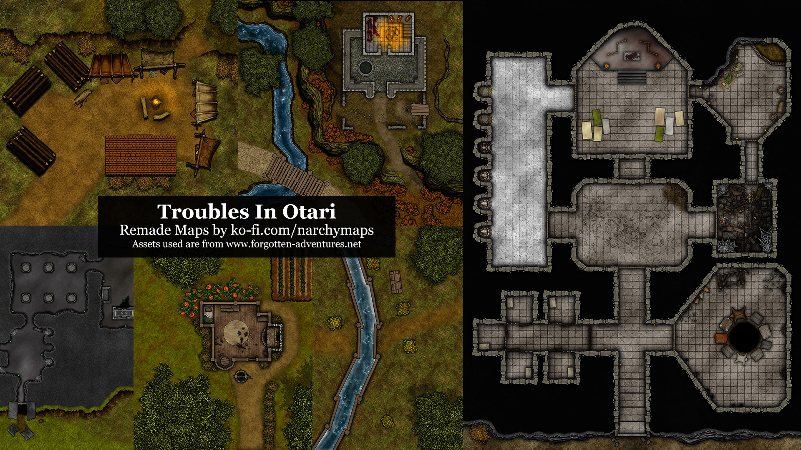

# Troubles in Otari maps remake

Foundry 0.8.x only - all scenes use foreground layers and overhead tiles/roofs.  

This FoundryVTT module is compilation of maps for the Pathfinder Second Edition TROUBLES IN OTARI adventures. It includes maps made by myself for my own game - but shared with everyone in the hope that you will find it useful.

All maps are designed for for [FoundryVTT](https://foundryvtt.com/) - with walls, doors and windows set up. If you find a mistake, let me know. 

The module does not contain any of the material or content from the book, and you will need to purchase your own copy to play it. You should support Paizo and their awesome product by [buying the darn books](https://paizo.com/products/btq026k1/discuss?Pathfinder-Adventure-Troubles-in-Otari).

Find @narchy on https://discord.gg/foundryvtt for updates and questions!

Everything is free, but if you want to make a donation to my RPG book buying addiction, then feel free!

https://ko-fi.com/narchymaps

https://www.buymeacoffee.com/narchym

# Credit

PAIZO - Some of the maps uses trademarks and/or copyrights owned by Paizo Inc., used under [Paizo's Community Use Policy](https://www.paizo.com/communityuse). We are expressly prohibited from charging you to use or access this content. The maps are not published, endorsed, or specifically approved by Paizo. For more information about Paizo Inc. and Paizo products, [visit paizo.com](http://www.paizo.com).

FORGOTTEN ADVENTURES - Assets used to create this map are from [Forgotten Adventures](https://www.forgotten-adventures.net/info/). These guys rock.

CC0 TEXTURES - Contains assets from [CC0Textures.com](https://www.CC0Textures.com), licensed under CC0 1.0 Universal.

NARCHY - Hey, it's me! Some of the weirder assets are my own creations.

Thank you to [Ustin](https://gitlab.com/Ustin/) for pointing me in the right direction on how to setup this module, and Freeman for taking the time to check for my mistakes! :)

# More Maps

I make maps for most of the games I run, and they are [freely available to download here on Google Drive](https://drive.google.com/drive/folders/1x9nvVv0a54C1ecSoGtqDOaxoWVA8UJ5T?usp=sharing). You can go ahead and use them freely without installing this module, and you will find maps in there long before I get around to adding them to a module! All maps are stamped with the grid size, so you can set them up easily in your virtual tabletop environment of choice. 

# Installation

Once you have installed and activated the module, the scenes will appear as compendium in your game. Just import that, and you will have all the scenes ready to go - complete with walls etc. 

```
https://gitlab.com/narchy-maps/troubles-in-otari-remade-maps/-/raw/main/module.json
```
[](https://gitlab.com/narchy-maps/troubles-in-otari-remade-maps/-/blob/main/preview/preview.jpg)


